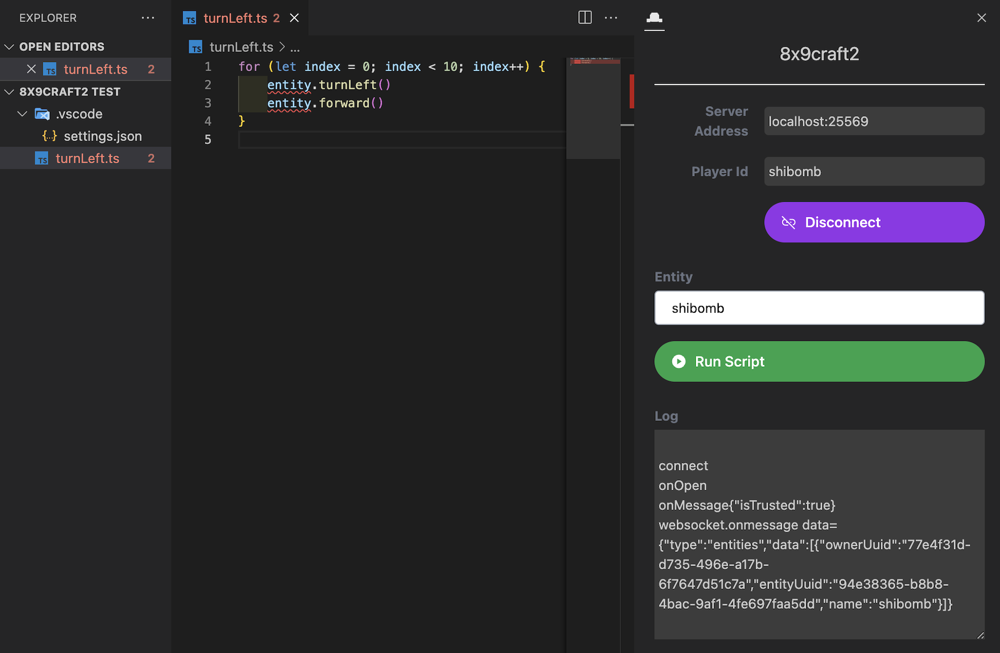

# 8x9craft2 Extension

<p align="center">
  
</p>

hackCraft2のVSCode拡張機能です。Minecraftでプログラミングを楽しむためのツールです。

## 準備

### 1. 拡張機能のインストール

1. VSCodeを開く
2. 拡張機能タブ（Ctrl/Cmd + Shift + X）を開く
3. "hackCraft2" を検索
4. インストールボタンをクリック

### 2. 拡張機能ビューの表示

- VSCodeのステータスバーにあるhackCraftへ接続をクリック
- または、コマンドパレット（`Ctrl/Cmd + Shift + P`）を開き、`8x9craft2: Focus 8x9craft2-view` を選択
- 推奨: ビューパネルをVSCodeウィンドウの右側に移動すると使いやすいです

### 3. サーバーアドレスの取得

以下のいずれかの方法でサーバーアドレスを取得してください：

- a) 8x9craft2プラグインがインストールされたMinecraftサーバーを起動
  - 例: "localhost:25570"
- b) 先生から提供されたアドレスを使用
  - 例: "192.168.xxx.xxx:25570"

### 4. Minecraftの起動

1. Minecraft Java Editionを起動
2. マルチプレイを開始

## プログラミングと実行

### 1. サーバーへの接続

1. VSCodeの8x9craft2拡張機能ビューで
2. "Server Address"にサーバーアドレスを入力
3. "Player Id"にMinecraftのプレイヤーIDを入力
4. "Connect"ボタンをクリックしてログインし、エンティティを取得

### 2. プログラミングを始めましょう！

VSCodeで以下の言語を使ってプログラミングができます：
- TypeScript (.ts)
- JavaScript (.js)
- Python (.py)

例：

```javascript
// 4x4の正方形を描く
for (let i = 0; i < 4; i++) {
    for (let j = 0; j < 4; j++) {
        entity.forward()
    }
    entity.turnLeft()
}
```

### 3. 実行

1. VSCodeの8x9craft2拡張機能ビューで
2. 操作したいエンティティを選択
3. "Run Script"ボタンをクリックして実行
4. Minecraftで動作を確認！

## サポートされている機能

- 複数のプログラミング言語（TypeScript, JavaScript, Python）に対応
- エンティティの操作（移動、回転など）
- 3Dビューの表示
- サーバー接続状態の管理
- スクリプトの実行/停止

## 参考リンク

- [8x9craft2公式サイト](http://craft2.8x9.jp/ja/)
- [8x9craft2 APIリファレンス](http://wiki.craft2.8x9.jp/wiki/Category:APIs)
- [8x9.jp](http://8x9.jp/)

## トラブルシューティング

- 接続できない場合：
  - サーバーアドレスとポート番号が正しいか確認
  - Minecraftサーバーが起動しているか確認
  - ファイアウォールの設定を確認

- スクリプトが実行できない場合：
  - エンティティが選択されているか確認
  - サーバーに接続されているか確認
  - コードに構文エラーがないか確認
