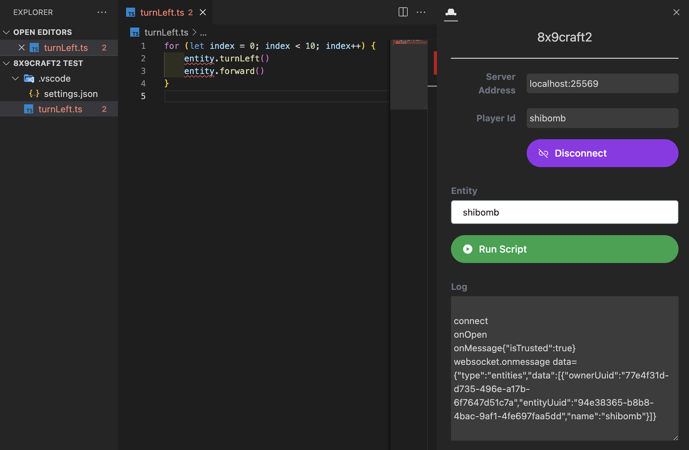

# 8x9craf2 Extension

  

8x9craft2 extension build with [Base Vue 3 Sidebar View Extension](https://github.com/joesobo/Vue3BaseExtension)
A Vue 3, Vite built template can be used to create a VSCode sidebar extension by providing a structure code and utilizing the vite build tool to compile and bundle the extension for deployment to VSCode. This template contains everything you need to get started building your extension right away. With this template, you can leverage the features and capabilities of Vue 3 to build powerful and interactive extensions for VSCode.

## Includes:

- [x] Typescript
- [x] Vue 3
- [x] Vite
- [x] Tailwindcss
  - [x] Vscode Default style Tailwind config
- [x] Iconify via unplugin
- [x] I18n via unplugin
- [x] Vitest
  - [x] Vitest UI
- [x] Testing Library
- [x] Decent Linting
- [x] CircleCI
- [x] Basic VSCode API Message Examples

## Get Started:

Install dependencies:

- `yarn install`

Run the extension:

- Enter `yarn watch` in the console
- Press `f5` on the `extension.ts` to open a debug window (or select in menu "Debug" -> "Run Extension")
- Navigate to the extension icon seen on the left sidebar (or open command palette (`Ctrl/Cmd + Shift + P`) and select `View: Vue 3 Base Extension` to open webview view.)

Publish the extension:

- `npm install -g @vscode/vsce`
- `vsce package`
- `vsce publish`

## Recommended VSCode Extensions

- [Vitest](https://marketplace.visualstudio.com/items?itemName=ZixuanChen.vitest-explorer)
- [Volar](https://marketplace.visualstudio.com/items?itemName=Vue.volar)
- [I18n A11y](https://marketplace.visualstudio.com/items?itemName=Lokalise.i18n-ally)
- [Iconify Intellisense](https://marketplace.visualstudio.com/items?itemName=antfu.iconify)

## References

- [Webviews](https://code.visualstudio.com/api/extension-guides/webview)
- [UX Guidelines](https://code.visualstudio.com/api/ux-guidelines/overview)
- [Webview view API](https://code.visualstudio.com/api/references/vscode-api#WebviewView)
- [Theme Guidelines](https://code.visualstudio.com/api/references/theme-color)
